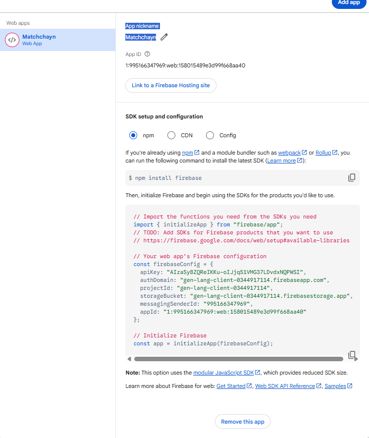

# MatchChayn: Cyber-Midnight Edition 🌌

MatchChayn is a premium, localized networking and dating platform engineered for the modern web and mobile. Built on the **Cyber-Midnight** design system, it delivers a high-performance, visually stunning experience focused on "vibing on-chain" and frequency-based matching.

---

## 💎 Project Vision
MatchChayn isn't just a dating app; it's a social frequency ecosystem. We prioritize authentic identity verification (via video) and secure, decoupled data management to ensure that every match is real and every connection is high-fidelity.

---

## 🛠️ Core Technology Stack
- **Frontend**: React 19 + Vite 6 (High-speed HMR)
- **Styling**: Vanilla CSS + Framer Motion (Cyber-Midnight aesthetics)
- **Database**: Google Firebase Firestore (Real-time NoSQL)
- **Authentication**: Firebase Auth + Custom Server-side OTP (Node.js)
- **Serverless API**: Node.js + Express (Deployed as Vercel Functions)
- **Media Storage**: Cloudflare R2 (S3-compatible, ultra-low latency)
- **Email Delivery**: Resend (Transactional & Welcome emails)
- **Notifications**: SweetAlert2 (Premium, consistent UI modals)

---

## 🔐 Authentication & Security Workflow

### 1. Hybrid Authentication Strategy
We use a two-step verification process to eliminate bots and ensure high-quality signups:
1.  **Backend Verification**: Users enter an email; our Node.js server generates a cryptographically secure 4-digit OTP.
2.  **Resend Integration**: The OTP is delivered via a premium HTML template.
3.  **Firebase Handoff**: Once verified, the frontend uses Firebase Auth to create the persistent account, keeping secrets off the client-side.

### 2. Firestore Security Model
Our `firestore.rules` are hardened for production:
- **Users**: Users can only write to their own profile.
- **Admin Access**: Hardcoded administrative emails (e.g., `josephakpansunday@gmail.com`) have global read/write privileges and bypass standard restriction filters for statistics aggregation.
- **Matches/Messages**: Strict ownership checks; you can only read messages where you are either the `sender` or `receiver`.

---

## ☁️ Media Infrastructure (Cloudflare R2)

To support 4K intro videos and high-res photos without slowing down the app, we use a **Direct-to-Object-Storage** pattern.

1.  **Presigned URLs**: The client requests a temporary write-permission URL from `/api/media/presigned-url`.
2.  **S3-Compatible Upload**: The client `PUT`s the file directly to Cloudflare R2.
3.  **Metadata Storage**: Only the public URL is saved to Firestore.

**Bucket Requirements**:
Ensure your R2 bucket has CORS enabled to allow `PUT` requests from your domain:
```json
[
  {
    "AllowedOrigins": ["*"],
    "AllowedMethods": ["GET", "PUT", "POST", "DELETE", "HEAD"],
    "AllowedHeaders": ["*"],
    "ExposeHeaders": ["ETag"]
  }
]
```

---

## 📊 Database Schema (Main Collections)

### `users`
```json
{
  "uid": "string",
  "email": "string",
  "displayName": "string",
  "bio": "string",
  "gender": "male | female | non-binary",
  "onboardingStatus": "started | completed",
  "avatarUrl": "url",
  "media": [{"type": "image", "url": "url"}, {"type": "video", "url": "url"}],
  "interests": ["string"],
  "preferences": {"lookingFor": "string", "ageRange": [18, 99]},
  "role": "user | admin"
}
```

### `matches`
```json
{
  "users": ["uid_1", "uid_2"],
  "matchedAt": "timestamp",
  "status": "active"
}
```

### `messages`
```json
{
  "sender": "uid",
  "receiver": "uid",
  "content": "string",
  "timestamp": "timestamp",
  "isRead": "boolean"
}
```

---

## 📱 Flutter Mobile Implementation Guide

Mobile developers can mirror the MatchChayn experience using the core Firebase SDKs and our custom API endpoints.

### 1. Setup
```yaml
dependencies:
  firebase_auth: ^5.0.0
  cloud_firestore: ^5.0.0
  http: ^1.2.0
  image_picker: ^1.1.0
  video_player: ^2.8.0
```

### 2. Implementation Flow
- **OTP Implementation**: Fetch your codes from the API: `http.post(Uri.parse('$baseUrl/api/auth/send-otp'), body: {'email': email})`.
- **Media Upload**: Use the `http` package to `PUT` files to the presigned URLs returned by our backend.
- **Aesthetics**: Use `0xFF090A1E` for backgrounds. Recreate the "Glassmorphism" using `BackdropFilter` with a `sigmaX/Y` of `10.0`.

---

## 🚀 Deployment & Environment Variables

To deploy to **Vercel**, you must configure these variables in the dashboard:

| Category | Variables |
| :--- | :--- |
| **Resend** | `RESEND_API_KEY` |
| **Cloudflare** | `CLOUDFLARE_ACCOUNT_ID`, `CLOUDFLARE_ACCESS_KEY_ID`, `CLOUDFLARE_SECRET_ACCESS_KEY` |
| **Storage** | `CLOUDFLARE_BUCKET_NAME`, `CLOUDFLARE_PUBLIC_DOMAIN` |
| **Firebase** | (Managed via client-side `.env.local` or environment secrets) |

### Deployment Steps:
1. `npm run build` locally to verify there are no TypeScript errors.
2. Push your code to GitHub.
3. Import to Vercel (Auto-detects Vite).
4. Add all environment variables.
5. Deploy.

---

## ⚡ Local Development & Concurrent Execution
For rapid local iteration, MatchChayn is configured to boot both the frontend and backend simultaneously:
1. Clone the repo: `git clone https://github.com/Matchchayn/MatchChayn_Web.git`
2. Install all required dependencies: `npm install`
3. Create a `.env` file with your credentials (see variables above).
4. Run the full stack: `npm run dev`
    - **Note for Mobile Devs**: This magic command utilizes `concurrently` to spin up both the Vite frontend (`localhost:5173`) and the Express Node server (`localhost:3000`) at exactly the same time. You do not need to boot them in separate terminal windows.

---

## 📦 Complete Dependencies List
For developer reference, especially when mapping web functionality to native mobile libraries, here is the full list of production dependencies required by this application:
- `@aws-sdk/client-s3`: 3.1018.0
- `@aws-sdk/s3-request-presigner`: 3.1018.0
- `firebase`: 12.11.0
- `express`: 4.21.2
- `react` / `react-dom`: 19.0.0
- `react-router-dom`: 7.13.2
- `vite`: 6.2.0
- `tailwindcss` / `@tailwindcss/vite`: 4.1.14
- `motion`: 12.23.24
- `lucide-react`: 0.546.0
- `sweetalert2`: 11.26.24
- `resend`: 6.9.4
- `clsx`: 2.1.1
- `tailwind-merge`: 3.5.0
- `date-fns`: 4.1.0
- `emoji-picker-react`: 4.18.0
- `dotenv`: 17.2.3

---

## ⚠️ Database Decision Note (Apology Modal)
Due to recent database schema transitions that resulted in isolated data loss, we have implemented a mandatory **Apology Modal** on the Login page. Users from the previous "beta" wave are advised to sign up again with authentic data and video verification. This is the **final wave** of data migration.
